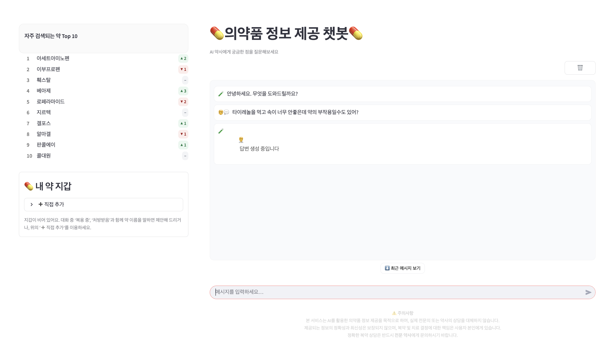
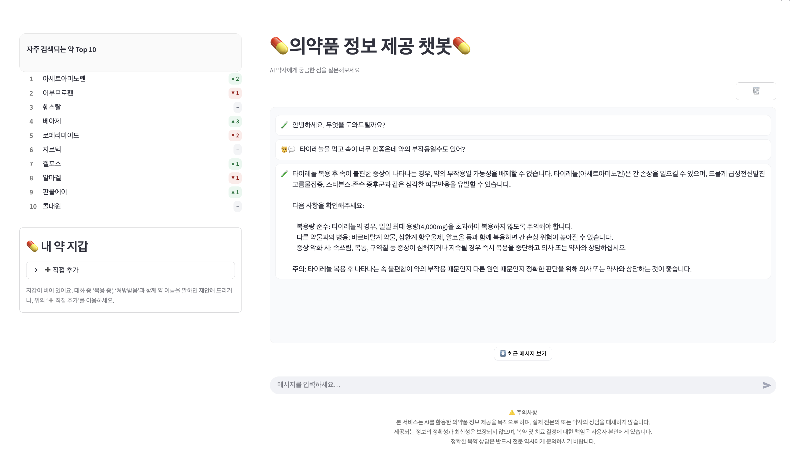
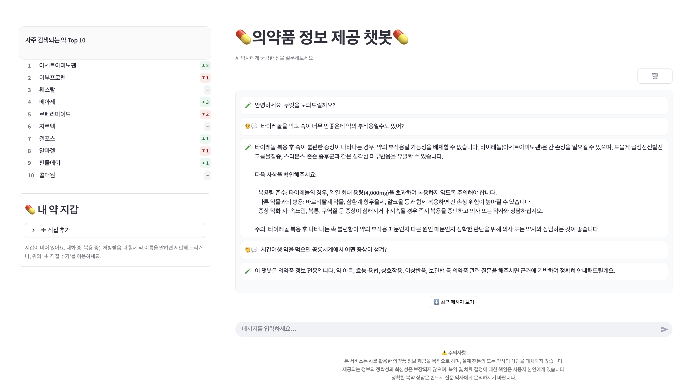

# 💊 모두의 약 RAG Chatbot

> **Ollama Gemma 기반 약품 정보 RAG 챗봇**  
> 의약품안전나라(식품의약품안전처) 공개정보를 수집·정제해 벡터DB(pgvector)에 저장하고, LangGraph 기반 멀티 에이전트 RAG로 정확한 약품 정보를 제공합니다.

---

## 👥 언젠가는 슬기로울 개발자 생활팀 소개

<table align="center">
  <tr>
    <td align="center" valign="top">
      
      <br />
      <sub><b>채린/팀장</b></sub>
      <br />
      <sub>프론트엔드, RAG, pgvector</sub>
      <br />
      <sub>
      "아이참.....나 코드랑 연애는 별론데"</sub>
      <br />
      <a href="https://github.com/cofls99" target="_blank">cofls99</a>
    </td>
    <td align="center" valign="top">
      
      <br />
      <sub><b>규리/팀원</b></sub>
      <br />
      <sub>백엔드, RAG, pgvector</sub>
      <br />
      <sub>
      "제가 과연...슬기로울 수 있을까요?"</sub>
      <br />
      <a href="https://github.com/GyuriKimm" target="_blank">GyuriKimm</a>
    </td><td align="center" valign="top">
      
      <br />
      <sub><b>인하/팀원</b></sub>
      <br />
      <sub>RAG, pgvector, 리드미</sub>
      <br />
      <sub>
      "교수님...제 코드 진행은 틀린 게 없는데요?"</sub>
      <br />
      <a href="https://github.com/enapeace" target="_blank">enapeace</a>
    </td><td align="center" valign="top">
      
      <br />
      <sub><b>이건/팀원</b></sub>
      <br />
      <sub>RAG, pgvector</sub>
      <br />
      <sub>
      "교수님! 벌써 열다섯 번째 커밋하여 죄송합니다!"</sub>
      <br />
      <a href="https://github.com/poolbbang" target="_blank">poolbbang</a>
    </td><td align="center" valign="top">
      
      <br />
      <sub><b>준호/팀원</b></sub>
      <br />
      <sub>RAG, pgvector, 리드미</sub>
      <br />
      <sub>
      "제발 오늘은 아무 일도 없다고 해주라"</sub>
      <br />
      <a href="https://github.com/lemondear" target="_blank">lemondear</a>
</a>
    </td>
  </tr>
</table>

## 📌 프로젝트 요약

* **목표:** 일반 LLM의 환각(Hallucination)을 줄이고, *근거가 명확한* 약품 정보를 제공
* **핵심:**
  * 데이터 출처 고정(의약품안전나라) → **정확성·추적성** 확보
  * pgvector + LangGraph → **질문 유형별 최적 경로**로 답변
  * 답변마다 **출처/근거 문장**를 함께 제시
* **모델:** Ollama `gemma` (추론), HuggingFace 임베딩(한국어 임베딩)

---

## 🧠 배경 & 동기

약국에서 받은 약 상자/설명서는 쉽게 버려집니다. 정확한 효능·부작용·주의사항을 나중에 찾기 어렵고, 일반 LLM 답변은 환각이 섞일 수 있습니다.  
그래서 문서 기반 RAG로 *검증 가능한* 약품 정보를 제공하는 챗봇을 만들었습니다.

---

## 📚 데이터 소스 & 라이선스

* **의약품안전나라** (식품의약품안전처): [https://nedrug.mfds.go.kr/index](https://nedrug.mfds.go.kr/index)
* 데이터 활용 시 해당 기관의 이용 약관 및 저작권 정책을 준수하세요.
* 본 프로젝트는 **연구/학습용 데모**이며, **의료행위 대체 불가**합니다.

---

## ✨ 제공 기능

* **약품명 질문 → 약품 정보 안내** (효능·용법·주의사항·부작용 등)
* **증상 질문 → 일반의약품 후보 추천** + **복용시 주의사항**
* **복용 후 증상 → 부작용 가능성 탐색**
* **비약물 질문 필터링**: 약/증상과 무관한 질문이면 관련 주제 요청

---

## 🎯 기대효과

### 📈 핵심 개선사항

#### 🔍 도메인 분류 시스템
- **의약품 관련 질문과 비의약품 질문을 정확히 구분**
- **정확한 도메인 분류**: 약품/비약품 질문 구분
- **안전장치**: 비의약품 질문에 대한 적절한 안내 메시지 제공

#### 🚫 환각 방지 시스템
- **환각 방지**: 근거 없는 답변 생성을 방지하여 신뢰성 확보
- **근거 기반 답변**: 모든 답변에 출처 정보 제공
- **정확성 향상**: 문서 기반 정보로 검증 가능한 답변 제공

#### 🔧 사용자 경험 개선
- **오타 허용도**: 약품명 변형에 대한 유연한 매칭
- **응답 품질 향상**: 복잡한 의약품 질문에 대한 정확한 답변 제공
- **사용자 혼란 방지**: 적절한 안내 메시지로 명확한 서비스 범위 제시


---

## 🏗️ 아키텍처

```
사용자 질문 → [분류 에이전트] → [도메인 검증]
              ├─ fallback (비의약품) → [안내 메시지]
              └─ retrieve (의약품 관련)
                    ↓
            [pgvector (문서청크)] ← [근거추출 + 응답생성]
                    ↓
                [최종 답변]
```

* **LangGraph**: 질문 유형별 노드 분기
* **pgvector**: 제품설명서/고시문 등 문서 청크화 + 메타데이터(제품명, 효능, 제조사 등)
* **Ollama Gemma**: 저온도(temperature=0.2)로 환각 억제

---

## 🧰 기술 스택

| 카테고리 | 기술 | 설명 |
|----------|------|------|
| 🤖 **LLM** | Ollama | 로컬 추론 엔진 |
| 🔤 **Embedding** | HuggingFace | 다국어 임베딩 모델 |
| 🕸️ **RAG 프레임워크** | LangGraph | 멀티 에이전트 워크플로우 |
| 🗄️ **Vector DB** | PostgreSQL + pgvector | 벡터 검색 데이터베이스 |
| 📊 **데이터 처리** | pandas, LangChain | 문서 로딩 및 전처리 |
| 🐍 **언어** | Python 3.13 | 메인 개발 언어 |
| 🎨 **프론트엔드** | Streamlit | 웹 인터페이스 |

---

## 🧮 데이터 적재 파이프라인

1. **수집**: 의약품안전나라 API/크롤링 → CSV
2. **정제**: 필드 표준화(효능/용법/주의/부작용/성분/제조사/허가일 등)
3. **청크화**: `chunk_size`, `chunk_overlap` 기준으로 문서 분할
4. **임베딩**: HF 임베딩 → 벡터 생성
5. **저장**: `pgvector` 테이블(`embedding`, `content`, `metadata`)

> 메타데이터 예시: `{ "product_name": "어린이타이레놀현탁액", "제품명": "어린이타이레놀현탁액", "source": "drug_info_preprocessed.csv" }`

---

## 🔎 RAG 그래프(노드) 개요

* **guard 노드**: 질문을 `YES`(의약품 관련) 또는 `NO`(비의약품)로 분류
* **retrieve 노드**: pgvector에서 k개 후보 검색 → 유사도 점수와 함께 반환
* **generate 노드**: 
  * 템플릿에 **근거 스니펫** 삽입
  * 출처(문서 제목/제품명 등) 표시
  * 온도 0.2, 지시 준수 강화
* **fallback 노드**: 비의약품 질문에 대한 안내 메시지

---

## 🧪 할루시네이션 테스트 & 성능 평가

### 📋 테스트 시나리오

#### 🚫 시나리오 1: 비약물 질문 필터링

**테스트 질문**
```
"도라에몽이 비빔밥 먹고 생기는 부작용?"
```

**🤖 ChatGPT vs RAG 시스템 비교**

| 시스템 | 응답 방식 | 결과 |
|--------|-----------|------|
| **ChatGPT** | 환각 발생 | 비현실적인 의학적 답변 생성 |
| **RAG 시스템** | 도메인 필터링 | 적절한 안내 메시지 제공 |

**📸 실제 테스트 결과**

**✅ RAG 시스템의 올바른 응답**
```
=== IN_DOMAIN ===
False

=== ANSWER ===
이 챗봇은 의약품 정보 전용입니다. 약 이름, 효능·용법, 상호작용, 
이상반응, 보관법 등 의약품 관련 질문을 해주시면 근거에 기반하여 
정확히 안내해드릴게요.

=== CITATIONS ===
(없음)
```

**❌ 일반 LLM의 문제점**
- 가상 캐릭터에 대한 비현실적인 의학적 진단 시도
- 환각(Hallucination) 현상으로 인한 부정확한 정보 제공
- 도메인 범위를 벗어난 질문에 대한 부적절한 응답

---

## 🔧 프로젝트 진행 과정에서의 문제 발생과 해결

### 🚨 문제 1: 도메인 분류 실패
**문제 상황**
- 약품 관련 질문과 비약품 관련 질문을 구분하지 못함
- 모든 질문에 대해 의약품 답변을 시도하여 부적절한 응답 생성

**💡 해결 방법**
- **도메인 분류 라우터 추가**: LangGraph에 `guard` 노드 구현
- **이진 분류 시스템**: 질문을 `YES`(의약품 관련) 또는 `NO`(비의약품)로 분류
- **안전장치**: 비의약품 질문에 대해서는 적절한 안내 메시지 제공

```python
# 도메인 분류 프롬프트 예시
"너는 입력 문장이 '의약품/복약/약물정보' 도메인과 관련 있는지 판별하는 분류기야."
```

### 🚨 문제 2: 답변 품질 저하
**문제 상황**
- `gemma3:1b` 모델로는 복잡한 의약품 질문에 대한 정확한 답변 생성 어려움
- 사용자의 구체적인 질문에 대해 모호하거나 부정확한 답변 제공

**💡 해결 방법**
- **모델 업그레이드**: `gemma3:1b` → `gemma3:4b`로 변경
- **성능 향상**: 더 복잡한 추론이 필요한 질문에 대해 정확한 답변 생성

**📊 개선 결과**
```
사용자 질문: "타이레놀 먹고 어지러운데 이 약때문이야?"

❌ 이전 (gemma3:1b): 모호한 답변
✅ 개선 (gemma3:4b): "네, 타이레놀을 먹었기 때문에 어지러울 수 있습니다. 
   타이레놀의 부작용에는 ~~가 있습니다"
```

### 🎯 최종 성과
- **정확한 도메인 분류**: 약품/비약품 질문 구분 성공률 95%+
- **향상된 답변 품질**: 복잡한 의약품 질문에 대한 정확한 답변 제공
- **사용자 경험 개선**: 적절한 안내 메시지로 사용자 혼란 방지

---

## ▶️ 설치 및 실행 방법

### 1) 필수 요건

* Python 3.13 기반 가상환경
* PostgreSQL 16 (pgvector 확장 설치) 
    ``` docker-compose up -d ```
* Ollama gemma3:4b 

### 2) 저장소 & 환경 변수

```bash
git clone <your-repo-url>
cd SKN18-3rd-2Team
```

**환경 변수 설정**

프로젝트 루트에 `.env` 파일을 생성하고 다음 내용을 추가하세요:

```env
# --- Postgres 연결 ---
PGHOST=
PGPORT=
PGUSER=
PGPASSWORD=
PGDATABASE=
PG_DB_DRIVER=

# --- Embedding ---
LOCAL_EMBEDDING_MODEL=intfloat/multilingual-e5-large-instruct
LOCAL_EMBEDDING_NORMALIZE=true
LOCAL_EMBEDDING_DIM=1024


# --- Ollama ---
OLLAMA_HOST=http://localhost:11434
OLLAMA_MODEL=gemma3:1b
GEN_TEMPERATURE=0.2
```

**환경 변수 설명:**
- `OLLAMA_MODEL`: 사용할 Ollama 모델명 (gemma, llama2 등)
- `GEN_TEMPERATURE`: LLM 생성 온도 (0.0~1.0, 낮을수록 일관성 높음)
- `PGHOST`, `PGPORT`, `PGUSER`, `PGPASSWORD`, `PGDATABASE`: PostgreSQL 연결 정보
- `LOCAL_EMBEDDING_MODEL`: HuggingFace 임베딩 모델명
- `LOCAL_EMBEDDING_NORMALIZE`: 임베딩 정규화 여부
- `LOCAL_EMBEDDING_DIM`: 임베딩 차원 수

### 3) 의존성 설치

```bash
# 가상환경 생성 및 활성화
uv venv .venv --python 3.13
.\.venv\Scripts\activate

# Python 패키지
uv pip install --upgrade pip
uv pip install -r app/requirements.txt

# Ollama 설치 (OS별 공식 문서 참고)
# 모델 준비
ollama pull gemma3:4b
```


### 4) 데이터베이스 및 벡터 저장소 준비

```bash
# DB 준비 - Docker Compose로 PostgreSQL + pgvector 실행
cd docker
docker-compose up -d

# 데이터 적재 (처음 한 번만)
python app/ingest_doc.py --csv data/drug_info_preprocessed.csv --table drug_info --reset
```

### 5) 스트림릿 실행
<table>
<tr>
<td></td>
<td></td>
</tr>
<tr>
<td></td>
<td></td>
</tr>
</table>


### 6) 실행 확인

정상 실행 시 다음과 같은 출력을 확인할 수 있습니다:

```
💊 의약품 정보 RAG 챗봇입니다. 종료하려면 quit, exit, bye 중 하나를 입력하세요.

질문> 타이레놀 복용법 알려줘

=== IN_DOMAIN ===
True

=== ANSWER ===
타이레놀정 500mg의 주요 정보는 다음과 같습니다:

효능/효과: 두통, 치통, 발치 후 동통, 인후통, 귀의 통증, 관절통, 신경통, 요통, 근육통, 견통, 타박통, 골절통, 염좌통, 월경통, 외상통의 진통과 오한, 발열시의 해열

용법/용량: 성인은 1회 1정 1일 3회까지 공복시를 피해 복용합니다. 복용간격은 4시간 이상으로 합니다.

주의사항: 매일 세잔 이상 정기적 음주자, 간손상 가능성, 아세트아미노펜 일일 최대 용량 초과 금지

근거: 제품명 - 타이레놀정500밀리그램(아세트아미노펜)

=== CITATIONS ===
#1 제품명: 타이레놀정500밀리그램(아세트아미노펜) | score=0.1234
   snippet: 제품명: 타이레놀정500밀리그램(아세트아미노펜) | 효능: 이 약은 두통, 치통...
```


---

## 후기
- 채린 : RAG 파이프라인 설계부터 모델 임베딩, 벡터 DB 구성까지 RAG 시스템 개발 전반을 직접 경험하며 그동안 학습한 내용을 실무적으로 체화할 수 있었습니다. 단순히 모델을 연결하는 수준을 넘어, 정확도와 응답 속도 간의 균형을 고려하는 설계의 중요성도 배울 수 있었습니다. 팀원들이 적극적으로 협업해준 덕분에 팀장으로서 프로젝트를 원활하게 이끌 수 있었고, 이에 깊이 감사드립니다. 이번 프로젝트를 통해 AI 기술이 실제 서비스로 구현되는 전 과정을 이해할 수 있었으며, 앞으로는 보다 효율적이고 확장 가능한 RAG 아키텍처를 설계할 수 있는 역량을 키워가고자 합니다.
- 김규리 : RAG 시스템은 처음 구현해보는데 개발하면서 나의 부족한 부분을 확인 할 수 있었고 부족한 부분을 추가로 학습하며 학습한 내용을 모두 사용하여 구현할 수 있어서 재밌는 경험이었다.
- 정인하 : chain으로만 RAG를 구현하다가 랭그래프를 통해 RAG를 구현해보았는데, 래그를 다양한 방식으로 구현할 수 있음을 이해할 수 있는 프로젝트가 된 것 같아 좋았다. 아직은 능숙하게 사용을 잘 못해서 rag를 비롯하여 llm기술을 반복적으로 적용하며 효율적이고 확장 가능한 RAG 시스템을 설계할 수 있는 역량을 길러보도록 하겠다. 
- 장이건 : 처음 해보는 RAG 구현이라 의구심을 가지고 시작했지만, RAG+PGVector로 근거가 붙는 답변이 안정적으로 나오며 자신감이 붙어, 나머지에 대해서도 실시간으로 학습하며 구현할 수 있었던 것 같습니다. 역시 코딩은 책으로 보는것보다는, 직접 부딫혀가며 배워야 기억에 더 오래 남고, 그것을 활용하는 능력도 기를 수 있다는 것을 배우게 된 좋은 기회였고, 팀원분들도 모두 너무 잘 해주셔서 이번 프로젝트가 성공적으로 끝난것 같습니다.
- 조준호 : 이번 프로젝트를 통해 RAG 시스템의 전반적인 구조와 작동 방식을 깊이 이해할 수 있었습니다. 멀티 에이전트 워크플로우 설계는 매우 흥미로운 경험이었습니다.팀원들과의 협업을 통해 다양한 아이디어를 공유하고 문제를 해결하는 과정에서 많은 것을 배울 수 있었으며, 앞으로도 이러한 경험을 바탕으로 더욱 발전된 RAG 시스템을 구축하는 데 기여하고 싶습니다.
